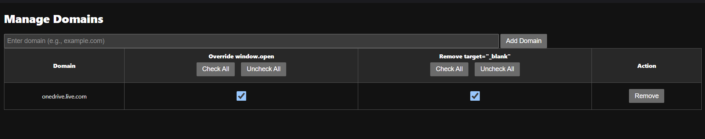

# **Window Open Override Browser Extension**

This extension allows you to override the behavior of `window.open` and remove `target="_blank"` from links on specified domains. It can be configured to work on any Chromium-based browser (such as Chrome, Edge, Brave) as well as Firefox.

## **Features**

* **Override `window.open`:** Ensures that links that would normally open in a new tab or window open in the current tab instead.
* **Remove `target="_blank"`:** Removes `target="_blank"` attributes from links, ensuring they open in the same tab.
* **Customizable Domains:** Specify which domains you want these behaviors to apply to.
* **Flexible Control:** Enable or disable both behaviors for individual domains.

## **Installation**

### **For Chrome, Edge, Brave, and Other Chromium-Based Browsers**

1. **[Download the repository](https://github.com/BhashkarGupta/Same-Tab/archive/refs/heads/main.zip):**
   * Clone the repository using Git: `https://github.com/BhashkarGupta/Same-Tab.git`
   * Or download the ZIP file and extract it.
2. **Open the Extension Page:**
   * Navigate to `chrome://extensions/` (for Chrome) or `edge://extensions/` (for Edge).
   * Toggle **Developer Mode** in the top-right corner.
3. **Load the Extension:**
   * Click on  **Load Unpacked** .
   * Select the folder where you extracted the extension files.
4. **Configure the Extension:**
   * Click on the extension icon in the toolbar.
   * Add the domain of the website you want to apply the `window.open` and `target="_blank"` overrides to.
   * Visit the **Options** page to manage your list of domains.

---

### **For Firefox**

1. **[Download the repository](https://github.com/BhashkarGupta/Same-Tab/archive/refs/heads/main.zip):**
   * Clone the repository using Git: `https://github.com/BhashkarGupta/Same-Tab.git`
   * Or download the ZIP file and extract it.
2. **Open the Extension Page:**
   * Go to `about:debugging#/runtime/this-firefox` in Firefox.
3. **Load the Extension:**
   * Click on  **Load Temporary Add-on** .
   * Select the `manifest.json` file from the extracted folder.
4. **Configure the Extension:**
   * Click on the extension icon in the toolbar.
   * Add the domain of the website where you want the overrides to be applied.
   * Visit the **Options** page to manage your list of domains.

---

## **Configuration Options**

* **Add a Domain:**
  * Click on the extension icon in the toolbar, and then click "Add Current Domain" to quickly add the domain of the currently active tab.
  * Alternatively, you can manually enter domains in the **Options** page.
* **Manage Domains:**
  * Go to the **Options** page (right-click the extension icon and click  **Options** ).
  * You can enable or disable `window.open` override and `target="_blank"` removal for each domain by toggling the checkboxes.
  * You can remove any domain from the list by clicking the **Remove** button.
* **Check/Uncheck All:**
  * On the **Options** page, you can check or uncheck all domains for both `window.open` override and `target="_blank"` removal.

## **Usage Instructions**

1. **Open a Supported Browser:**
   * Make sure the browser supports extensions (Chrome, Firefox, Edge, Brave, etc.).
2. **Install the Extension:**
   * Follow the steps above to install the extension.
3. **Add a Domain:**
   * Use the extension popup to add domains for which you want to override `window.open` and remove `target="_blank"`.
4. **Verify Behavior:**
   * Test the domain you've added by clicking links that would normally open in a new tab. These should now open in the same tab (if the `window.open` override is enabled).
   * Links with `target="_blank"` should no longer open in a new tab.
